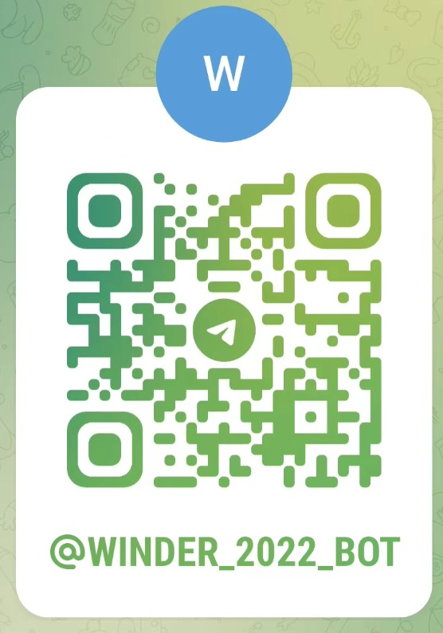

# Chatbot
This project is about a chatbot on Telegram to study the cloud computing. You can refer to the project of [chatbot-deploy](https://github.com/JianFengH/chatbot-deploy.git) which is conveinent for the environment of development and deployment. You can refer to [an instruction for bots on Telegram](https://core.telegram.org/bots) to learn about how to create a bot and more.

## An example of chatbot on Telegram


## Initialize Database
You can find sql files under the directory of `db` to initialize the database.

## Create a file `config.ini` under the root directory
```
[postgresql]
host=
database=
user=
password=

[telegram]
access_token=
``` 

## How to run

### Run python directly, in Terminal
```
pip install -r requirements.txt

python chatbot.py
```

### Run docker command to test chatbot image before pushing code
```
docker build -t chatbot:test .

docker run -it --rm -v "$(pwd)/config.ini:/app/config.ini"  --name test_chatbot chatbot:test
```

### Run the script to test chatbot image before pushing code
```
./docker-test.sh
```

### Run docker by using the remote chatbot image
You can view the remote chatbot image from [dockerjeffery/chatbot](https://hub.docker.com/repository/docker/dockerjeffery/chatbot).
```
docker run -it --rm -v "$(pwd)/config.ini:/app/config.ini"  --name test_chatbot dockerjeffery/chatbot
```
